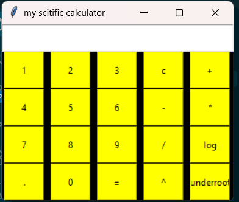

# 🧮 Scientific Calculator in Python

A simple scientific calculator built using **Python** and **Tkinter**.

This project was created while learning Python and GUI development.

## ✨ Features

- ➕ Addition
- ➖ Subtraction
- ✖️ Multiplication
- ➗ Division
- ^ Power
- √ Square root
- log Logarithm
- Decimal calculations
- Clear button
- Simple graphical interface

## 📸 Preview



## 🛠️ Technologies Used

- Python
- Tkinter
- Math module

## ▶️ How to Run

1. Make sure Python is installed.
2. Clone this repository.
3. Open the project folder in VS Code.
4. Run:

```bash
python calculator_app.py